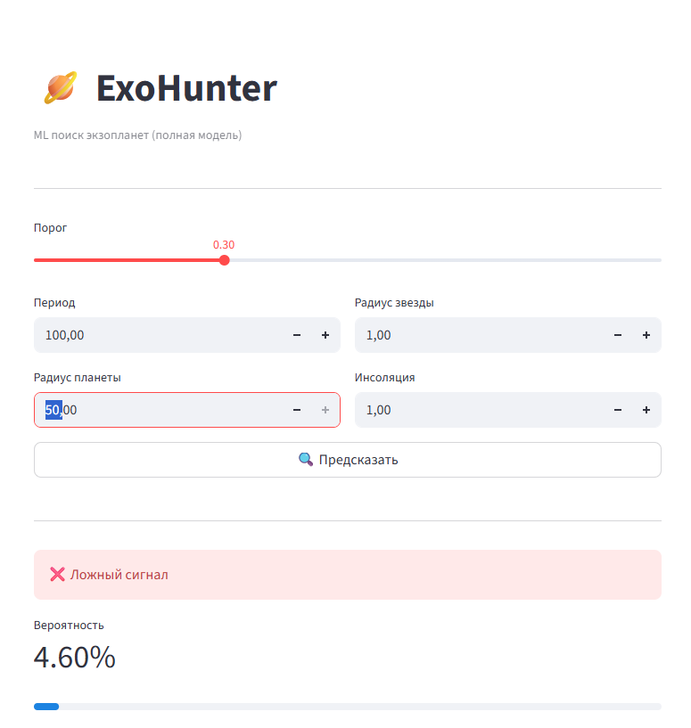

# Exoplanet-Detection
# 🪐 Exoplanet Detection with Machine Learning

A machine learning project for classifying Kepler Objects of Interest (KOIs) and identifying signals that are likely to correspond to exoplanets.

The project includes exploratory data analysis, feature engineering, a trained scikit-learn model, and an interactive Streamlit application.

## 🚀 Live Demo

**Streamlit app:**
https://exoplanet-detection-ezh5lotjcqtncuawa5rwrz.streamlit.app/

The application accepts several astronomical parameters, applies the same preprocessing and feature engineering used during model development, and returns a predicted class together with the model probability.

## 📌 Project Overview

The goal is to build an end-to-end machine learning workflow:

1. Load and inspect the Kepler dataset.
2. Perform exploratory data analysis.
3. Clean and preprocess the data.
4. Select relevant features.
5. Handle missing values.
6. Create engineered features.
7. Train and evaluate a classification model.
8. Save the trained model and preprocessing information.
9. Build and deploy an interactive Streamlit application.

## 🧠 Machine Learning

The project uses a **Random Forest classifier** implemented with Scikit-learn.

The machine learning workflow includes:

* data preprocessing
* feature selection
* missing-value handling
* feature engineering
* cross-validation
* hyperparameter tuning
* classification evaluation
* probability-based predictions

The deployed application uses a configurable probability threshold instead of relying only on the default 0.5 cutoff.

## 🔧 Feature Engineering

The project uses several engineered features, including:

* `log_period` — logarithmic transformation of orbital period
* `planet_star_radius_ratio` — planet radius relative to stellar radius
* `log_insol` — logarithmic transformation of stellar insolation

The Streamlit application reproduces the required transformations during inference and preserves the expected feature order.

## 📊 Application Inputs

The Streamlit application currently accepts:

* `koi_period` — orbital period
* `koi_prad` — planet radius
* `koi_srad` — stellar radius
* `koi_insol` — stellar insolation

The application then calculates the engineered features and returns:

* predicted class
* predicted probability
* visual probability indicator

## 🗂️ Project Structure

```text
Exoplanet-Detection/
│
├── data/
│   └── cumulative.csv
│
├── notebooks/
│   └── exoplanet_analysis.ipynb
│
├── screenshots/
│   └── demo.png
│
├── streamlit_app.py
├── exoplanet_model.pkl
├── features.pkl
├── medians.pkl
├── requirements.txt
├── README.md
└── docs/
    └── project_presentation.pptx
```

## 🛠️ Tech Stack

* Python
* Pandas
* NumPy
* Scikit-learn
* Matplotlib
* Joblib
* Streamlit
* Jupyter Notebook
* Git / GitHub

## ▶️ Run Locally

### 1. Clone the repository

```bash
git clone https://github.com/timur1101/Exoplanet-Detection.git
cd Exoplanet-Detection
```

### 2. Create a virtual environment

```bash
python -m venv .venv
```

### 3. Activate the environment

Windows:

```bash
.venv\Scripts\activate
```

macOS / Linux:

```bash
source .venv/bin/activate
```

### 4. Install dependencies

```bash
pip install -r requirements.txt
```

### 5. Run the Streamlit application

```bash
streamlit run streamlit_app.py
```

## 🖼️ Application Preview



## 📚 Project Materials

* **Live Demo:** https://exoplanet-detection-ezh5lotjcqtncuawa5rwrz.streamlit.app/
* **Analysis Notebook:** `notebooks/exoplanet_analysis.ipynb`
* **Project Presentation:** `docs/project_presentation.pptx`

## 👤 Author

**Timur Sultanbekov**

Data Science learner and aspiring Junior Data Scientist with an engineering background and industrial experience.

* GitHub: https://github.com/timur1101
* LinkedIn: https://www.linkedin.com/in/timur-sultanbekov-99a87010b/

Streamlit app for detecting exoplanets using machine learning.

